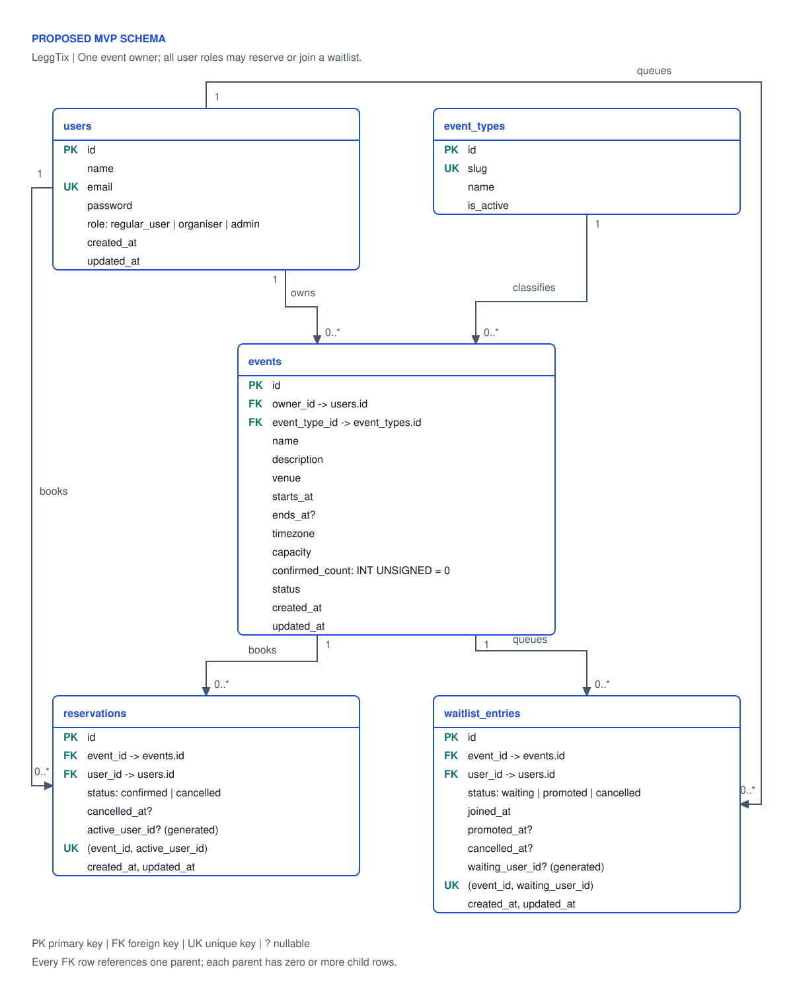

# LeggTix database design

Decision date: 6 October 2026. Scope: [issue #27](https://github.com/GLegg18/LeggTix/issues/27), the local product specification, and the project guidance in AGENTS.md. The MVP rules needed for implementation are restated here because local planning files are excluded from version control.

## Decision in brief

Build five domain tables: `users`, `event_types`, `events`, `reservations`, and `waitlist_entries`. Use one role field per user, one owner per event, and one place per reservation. Keep cancelled reservation attempts and previous waitlist attempts as history. Serialize all inventory changes through a locked event row in MySQL, with a guarded occupancy counter to keep the allocation path short during busy sales.

For a concrete two-customer timeline, start with [reservation races: last place and same seat](reservation-races.md). The [staged ticketing extension plan](ticketing-extensions.md) explains how venues, assigned seats, organiser teams, independent roles and paid checkout can fit later while this MVP remains five tables.

This is a proposed implementation contract for the next tickets, not a claim that these tables or protections already exist. The repository currently contains the Laravel skeleton with no domain migrations. Docker Compose selects MySQL 8.4; the design targets InnoDB on that version and the configured Laravel 13 / PHP 8.4 environment.

| Question | MVP decision | Reason |
| --- | --- | --- |
| Separate roles table? | `users.role`: `regular_user`, `organiser`, `admin` | Three fixed capability sets do not need editable roles or a mapping table. |
| Can organisers also book? | Yes; admins can book too | Customer capabilities are shared; a role describes management privileges. |
| Multiple organisers per event? | One `events.owner_id` | Ownership is clear and sufficient for the current spec. |
| User-to-event attendee pivot? | Use reservations and waitlist entries | These relationships have business state and history of their own. |
| Event categories/types? | One admin-managed `event_types` lookup | The user wants admins to add/edit types without a deployment. |
| Organiser type permissions? | Any active type | Confirmed by the user for the MVP; category grants are an extension. |
| Payments, ticket tiers, seats? | Deferred | The demo reserves one general-admission place; it does not sell a ticket. |
| Capacity counter or Redis inventory? | MySQL `events.confirmed_count`, maintained in the reservation transaction | The user's high-traffic requirement justifies avoiding a scan of all confirmed rows for each booking. |
| Waitlist promotion? | Automatic confirmation inside the ordinary cancellation transaction | Removes the one-place allocation gap; notifications are asynchronous, and large capacity increases use repeatable batches. |

The last decision interprets the spec's promotion as a free reservation, with joining the waitlist consenting to automatic promotion. Paid checkout would require an expiring offer/hold workflow instead.

## Relationships



[Open the SVG](diagrams/leggtix-database-er.svg). The drawing shows key fields; the tables below define the full contract. Entity boxes use a portrait layout and a chosen palette of ink `#0F172A`, ground `#FFFFFF`, primary `#1D4ED8`, muted `#475569`, and accent `#0F766E`.

- A user owns zero or more events; every event has exactly one owner.
- An event type classifies zero or more events; every event has exactly one type.
- Each reservation belongs to exactly one event and one user; both parents can have many historical attempts.
- Each waitlist entry belongs to exactly one event and one user; both parents can have many historical attempts.
- There is no direct reservation-to-waitlist foreign key. Promotion updates both records atomically; its notification receives the exact new reservation ID. A permanent link can be added later if support/reporting requires it.

## Schema conventions

- Primary keys are auto-incrementing `BIGINT UNSIGNED`; foreign keys use the same type. Numeric IDs are adequate for this local API and never substitute for authorization.
- Use InnoDB, `utf8mb4`, and the project's configured collation. Use explicit, named foreign keys, unique indexes, and enforced `CHECK` constraints. Stable status/role slugs are `VARCHAR` with PHP backed enums and matching database checks; editable event types use rows.
- All five tables have non-null `created_at` and `updated_at` as UTC `DATETIME(6)`. Other instants use the same representation. Set application/database session time to UTC, and convert for display using the event's IANA `timezone`. Validate offsets and daylight-saving ambiguities when accepting local times.
- Required fields are non-null unless marked nullable. Server-owned IDs, status transitions, generated columns, timestamps, and role/owner assignment are not general request-writable fields.
- Domain foreign keys use `ON DELETE RESTRICT` and `ON UPDATE RESTRICT`. Cancel events/reservations and retire types instead of cascading away history. Hard deletion of users with domain records is outside MVP; a future anonymisation/retention workflow must be deliberate. This is not a complete audit log or retention policy.
- Keep important searchable fields relational. An arbitrary metadata JSON column would weaken validation and is unnecessary for the defined fields.

### `users`

| Field | Type / rule | Purpose |
| --- | --- | --- |
| `id` | PK | Account identity. |
| `name` | `VARCHAR(255)` | Display name. |
| `email` | `VARCHAR(255)`, unique | Login identity; trim and normalise consistently before lookup/write. |
| `password` | `VARCHAR(255)` | Laravel password hash; never return it. |
| `role` | `VARCHAR(20)`, default `regular_user` | Check membership in `regular_user`, `organiser`, `admin`. |

Registration always creates `regular_user`. Role assignment uses trusted seed data or a separately authorised admin operation; registration and profile updates cannot accept role escalation. All roles can reserve/cancel their own places. Only organisers/admins create events; organisers manage only events they own, while admins may manage any event and event type.

The proposed database column is a checked `VARCHAR`, cast to a PHP backed enum, rather than a MySQL `ENUM`. The feature is not implemented yet. Organiser/admin capabilities include the customer capability set: a person who sometimes organises can book someone else's event using the same account and role. Independent global roles and scoped team roles can be introduced later without duplicating user accounts; see [the migration path](ticketing-extensions.md).

Use Laravel's established authentication tooling. Token/password-reset/email-verification/session tables and fields belong to the chosen authentication flow in [#5](https://github.com/GLegg18/LeggTix/issues/5), not a custom credentials model. `email_verified_at` and `remember_token` can be added if that flow uses them. Keep tokens hashed and private using the selected Laravel tooling. No role index is needed for the core queries.

### `event_types`

| Field | Type / rule | Purpose |
| --- | --- | --- |
| `id` | PK | Stable referenced identity. |
| `slug` | `VARCHAR(64)`, unique | Lowercase machine label, e.g. `concert`, `live-show`, `film-screening`. |
| `name` | `VARCHAR(100)` | Admin-editable display label. |
| `description` | `TEXT`, nullable | Optional explanation. |
| `is_active` | `BOOLEAN`, default true | Check value in `0, 1`; retire rather than delete referenced rows. |

A lookup is justified here because an admin can extend the catalogue. A PHP enum alone would make each new type a code deployment. Use one classification per event for MVP; genre tags and multiple classifications can follow later. An event type describes the event, whereas a future ticket type describes admission/pricing, such as standard or VIP.

Only admins mutate the catalogue. Allow label/description changes; keep a referenced slug stable. New event assignment and publication require an active type. Retirement does not cancel existing published events or invalidate their reservations. When assignment/publication and retirement compete, lock the relevant type row for the eligibility check inside the transaction; use the common lock order below. No organiser/type grant table is required now. An API or Filament screen for catalogue management remains follow-on implementation work; seeds can establish the initial types.

### `events`

| Field | Type / rule | Purpose |
| --- | --- | --- |
| `id` | PK | One scheduled occurrence. |
| `owner_id` | FK to `users.id` | Set from the authenticated creator; no public owner reassignment. |
| `event_type_id` | FK to `event_types.id` | One classification. |
| `name` | `VARCHAR(255)` | Listing title. |
| `description` | `TEXT` | Event information. |
| `venue` | `VARCHAR(255)` | Venue/location text for the MVP. |
| `starts_at` | UTC `DATETIME(6)` | Booking cutoff and listing order. |
| `ends_at` | UTC `DATETIME(6)`, nullable | Check `ends_at IS NULL OR ends_at > starts_at`. |
| `timezone` | `VARCHAR(64)` | Validated IANA identifier, e.g. `Europe/London`. |
| `capacity` | `INT UNSIGNED` | Check `capacity > 0`. |
| `confirmed_count` | `INT UNSIGNED`, default `0` | Guarded counter; check `confirmed_count <= capacity`. |
| `status` | `VARCHAR(20)`, default `draft` | Check `draft`, `published`, `cancelled`, `completed`. |

Useful indexes: `(status, starts_at, id)` for public upcoming lists; `(owner_id, status, starts_at, id)` for owner listings; `(event_type_id, status, starts_at, id)` for type-filtered upcoming lists. These also cover the owner/type FK leading columns. Avoid adding indexes to description, capacity, `confirmed_count`, or every field without a query that needs them. The counter must equal the number of confirmed reservation rows, including historical confirmed attendance on completed events; it is not cached availability.

Keep venue text until shared venue management, addresses or location search are requested. Store no image blobs; a later media feature can store an object/path reference. A recurring show is several event occurrences sharing a future series, not one row with several dates and an ambiguous capacity pool.

### `reservations`

| Field | Type / rule | Purpose |
| --- | --- | --- |
| `id` | PK | Identity of one booking attempt. |
| `event_id` | FK to `events.id` | Inventory pool. |
| `user_id` | FK to `users.id` | Reservation holder. |
| `status` | `VARCHAR(20)`, default `confirmed` | Check `confirmed`, `cancelled`. |
| `cancelled_at` | UTC `DATETIME(6)`, nullable | Null while confirmed; required when cancelled. |
| `active_user_id` | Generated nullable `BIGINT UNSIGNED` | `user_id` only while confirmed; otherwise null. |

Unique `(event_id, active_user_id)` prevents two confirmed attempts for the same event/user. Index `(event_id, status, id)` supports inventory/owner queries. Index `(user_id, created_at, id)` supports the authenticated user's history. `created_at` is the confirmation instant; no quantity, price, payment state, seat or barcode is implied.

### `waitlist_entries`

| Field | Type / rule | Purpose |
| --- | --- | --- |
| `id` | PK | Identity of one queue attempt. |
| `event_id` | FK to `events.id` | Requested event. |
| `user_id` | FK to `users.id` | Waiting account. |
| `status` | `VARCHAR(20)`, default `waiting` | Check `waiting`, `promoted`, `cancelled`. |
| `joined_at` | UTC `DATETIME(6)` | Assigned by the server after acquiring the event lock; immutable. |
| `promoted_at` | UTC `DATETIME(6)`, nullable | Required only for promoted attempts. |
| `cancelled_at` | UTC `DATETIME(6)`, nullable | Required only for cancelled attempts. |
| `waiting_user_id` | Generated nullable `BIGINT UNSIGNED` | `user_id` only while waiting; otherwise null. |

Unique `(event_id, waiting_user_id)` prevents two waiting attempts for the same event/user. Index `(event_id, status, joined_at, id)` supports FIFO selection and owner lists. Index `(user_id, created_at, id)` supports customer history and the user FK.

Select waiting entries by `joined_at ASC, id ASC`; the ID breaks equal-time ties. This orders accepted database joins, not network request arrival. Never accept a client-supplied queue time/position or rewrite positions after departures. Leaving then rejoining creates a fresh attempt at the back of the queue. A displayed position is derived from current waiting entries and can change.

## Constraints and lifecycle

### Active-only uniqueness with retained history

Illustrative DDL for the downstream migrations, not an executable migration in this ticket:

```sql
-- reservations
active_user_id BIGINT UNSIGNED GENERATED ALWAYS AS
    (CASE WHEN status = 'confirmed' THEN user_id ELSE NULL END) STORED,
UNIQUE KEY reservations_event_active_unique (event_id, active_user_id)

-- waitlist_entries
waiting_user_id BIGINT UNSIGNED GENERATED ALWAYS AS
    (CASE WHEN status = 'waiting' THEN user_id ELSE NULL END) STORED,
UNIQUE KEY waitlist_event_waiting_unique (event_id, waiting_user_id)
```

MySQL supports [generated columns](https://dev.mysql.com/doc/refman/8.4/en/create-table-generated-columns.html) and [unique indexes with multiple NULL values](https://dev.mysql.com/doc/refman/8.4/en/create-table.html). Our design uses that combination to constrain active attempts while retaining multiple terminal attempts. The ordinary `user_id` remains the FK; the generated columns are internal and are never assigned by application code.

Do not use unique `(event_id, user_id, status)`: it also limits cancelled history to one row. Unique `(event_id, user_id)` with repeated reactivation is smaller but loses separate booking attempts and makes a stale cancellation capable of cancelling a later booking. Here, rebooking always creates a new reservation ID.

Add state/timestamp checks as well as enum checks: a confirmed reservation has null `cancelled_at`; a cancelled reservation has non-null `cancelled_at`. A waiting entry has both terminal timestamps null; a promoted entry has only `promoted_at`; a cancelled entry has only `cancelled_at`. Validate transitions in Laravel; a row check alone cannot enforce a transition's previous state.

| Entity | Permitted transition / behaviour |
| --- | --- |
| Event | `draft -> published`, `draft -> cancelled`, `published -> cancelled`, `published -> completed`. Publication requires a future start; completion requires the start to have passed. Terminal events do not reopen in MVP. |
| Reservation | Insert `confirmed`; `confirmed -> cancelled`. Repeat cancellation of that same attempt succeeds without another capacity change/promotion. A new booking uses a new row. |
| Waitlist | Insert `waiting`; `waiting -> promoted` or `waiting -> cancelled`. Terminal attempts do not reactivate. |

Past is derived from `starts_at <= current UTC time`, not an additional status. A past event may still say published until explicitly completed, but cannot accept reservations/joins/promotions. Completion retains confirmed reservations as attendance history; it closes remaining waiting entries as cancelled. Cancelling an event atomically cancels confirmed reservations and waiting entries; neither operation promotes anyone. Already promoted entries retain their historical state.

MVP event management does not unpublish or transfer ownership. Capacity may change only under the inventory lock and may never fall below confirmed occupancy. Once there is any reservation or waitlist history, lock schedule/type changes out of the ordinary edit flow; rescheduling and its notification policy are a separate future workflow. Other listing metadata remains editable by owner/admin. Explicit event cancellation remains supported.

### What the database does and does not guarantee

| Invariant | Enforcement |
| --- | --- |
| Referenced user/event/type exists | Foreign keys. |
| Valid role/status, positive capacity, valid row timestamps | Non-null definitions and enforced checks. |
| At most one confirmed reservation and one waiting entry per pair | Separate active-only unique indexes. |
| Never both confirmed and waiting for the same pair | Event-locked Laravel transaction checking both tables; not enforced by those separate indexes. |
| Confirmed occupancy never exceeds capacity | Common event lock, guarded counter and reservation writes in one transaction. The check bounds the counter; it does not count child rows. |
| Only published, future events accept bookings | Revalidation after obtaining the event lock and just before allocation. |
| Users change only their own attempts; organisers manage their own events | Laravel Policies and explicitly writable fields; a FK does not confer permission. |

MySQL [CHECK constraints](https://dev.mysql.com/doc/refman/8.4/en/create-table-check-constraints.html) cannot query other tables or use nondeterministic `NOW()` to express these inventory/time rules. Direct SQL, ad-hoc seeders or admin code that bypass the workflow can break the transaction-enforced invariants. All application writers, including administrative actions, must use the same protocol.

## Transaction protocol

Use a focused Laravel action for each business operation. Locks must be acquired inside the transaction, never held while making an email/Redis/provider call. Laravel documents [`lockForUpdate()`](https://laravel.com/framework/docs/13.x/queries#pessimistic-locking) and [transaction/deadlock retries](https://laravel.com/framework/docs/13.x/database#database-transactions).

1. Start the transaction and lock `events.id` by PK with `SELECT ... FOR UPDATE`. Re-read status, start and capacity after the lock returns; do not trust an earlier controller-loaded event. Authorize the actor against the current event.
2. If changing/publishing the classification, lock the relevant event type next and verify it is active. Type retirement locks the type and never subsequently locks events. For multiple rows use ascending IDs.
3. Use the locked event's current `confirmed_count` and `capacity`. Read the relevant attempt rows with current locking reads using the indexes below; never scan/count every reservation to allocate one place. Event is always the first domain lock, optional type next; within a workflow visit child rows deterministically, and never acquire a second event out of order. Revalidate time eligibility immediately before allocation.
4. Apply counter changes and attempt changes together; commit. Increment with a guard requiring `confirmed_count < capacity` and assert that one event row was updated; decrement only for an actual `confirmed -> cancelled` transition with a positive-counter guard. Any uniqueness/check/write failure rolls back both changes. Retry the entire transaction on a deadlock with a bounded attempt count; recompute all state and perform no external side effects in the retry closure.
5. Dispatch notification jobs after commit with exact committed record IDs, and invalidate metadata caches after commit where relevant.

Why insist on current reads? InnoDB [consistent reads](https://dev.mysql.com/doc/refman/8.4/en/innodb-consistent-read.html) can retain an earlier snapshot within a transaction. Acquiring the event lock does not refresh a previous plain count or attempt lookup. A [locking read](https://dev.mysql.com/doc/refman/8.4/en/innodb-locking-reads.html) reads current data. Read the event/counter with `FOR UPDATE` and use locking lookups for eligibility/deduplication. This design works without changing the server isolation default.

The parent lock is the serialization point even when there are no child rows yet. It is held until commit/rollback. Different events have separate parent locks; index/range locks can still cause contention, so deadlock retries remain useful. A guarded increment can use `UPDATE events SET confirmed_count = confirmed_count + 1 WHERE id = ? AND confirmed_count < capacity` inside the already locked transaction, paired with the reservation insert. This does not independently prove that the counter matches its children; every writer, seed and administrative action must maintain both.

Provide a diagnostic/reconciliation command that locks one event first and compares the counter with confirmed rows using a current read, outside the request hot path. On mismatch, fail closed for repair and investigate; do not silently sell from an untrusted counter or reset it using an old snapshot. The command can use an explicit current-read strategy or read confirmed IDs under the event lock; no unverified locking aggregate is required. Concurrent operation tests must assert both `confirmed_count = COUNT(confirmed reservations)` and `confirmed_count <= capacity` after commit.

### Reserve and join

- **Reserve:** require authentication, a published future event, and no confirmed reservation. If the same user already has one, return a consistent duplicate outcome without allocating again. Process at most one bounded batch of existing eligible waiters from spare capacity; if eligible backlog remains, return a waiting/full outcome instead of looping across the entire queue or selling ahead of it. If the caller is waiting, allow that promotion path to confirm them, otherwise keep them waiting and reject a new direct booking; never leave both active records. Allocate a fresh reservation only when capacity remains after the queue. Full events reject booking without silently enrolling the caller. Return business outcomes after committing any successful promotion batch rather than throwing an exception that rolls those promotions back.
- **Join:** require a published future event that is currently full and no confirmed reservation. Duplicate waiting joins return the existing attempt without moving it. Create a new waiting attempt with a server time; available events direct the customer to reservation instead. Joining itself does not reserve capacity.
- **Leave:** mark that user's current waiting attempt cancelled under the same event lock; repeat leave has no additional effect. Do not cancel a promoted reservation through the leave-waitlist endpoint.

### Cancellation, promotion and capacity edits

Cancellation first verifies both event nesting and reservation ownership. After the common locks, change the exact confirmed attempt to cancelled and decrement the counter once, then fill the freed place from the oldest eligible waiter inside that transaction. For each promoted entry increment the counter with its guard, create one confirmed reservation, and mark the entry promoted atomically. The resulting customer has a reservation and a terminal waitlist record. No payment/acceptance step is implied. Event-wide cancellation closes active attempts and sets `confirmed_count = 0` in the same transaction; completion retains the count and confirmed attendance history.

Under the same protocol, a capacity increase fills the queue before newcomers can reserve; a decrease must be at least the current confirmed count. The promotion routine always reads current status/capacity and cannot run for a draft, cancelled, completed or past event. If an inconsistent waiting entry already has a confirmed reservation, close it as cancelled and continue; log this integrity anomaly rather than repeatedly selecting it. There are no account-suspension rules in MVP; add explicit eligibility and terminal-state rules if that feature arrives. Use no `SKIP LOCKED` for this strict FIFO path. Select the next waiter with `LIMIT 1`; normal cancellation frees at most one place. Limit entries examined as well as successful promotions so a run of inconsistent entries cannot make the transaction unbounded.

If a large capacity increase creates many places, process one bounded batch with the edit, then dispatch a repeatable promotion job after commit while both backlog and spare capacity remain. Each job locks the event, processes a bounded batch, and schedules a continuation after commit if needed. A command can invoke the same action to resume after interruption/lost enqueue; a later reserve request can also process one batch. Direct booking continues to reject queue bypass until the backlog is allocated. The after-commit enqueue gap applies here too: this design guarantees safe allocation on each run, not guaranteed eventual job delivery. Allocation need not hold one transaction across the whole backlog.

A retry of the same cancellation cannot promote again. If a repair/retry promotion action is invoked separately, it takes the event lock and fills only actual spare capacity using current waiting rows. Booking uniqueness and terminal waitlist state protect database effects; there is no dependency on queue delivery for allocating the cancelled place.

Queue notification with the newly created reservation ID and waitlist attempt ID. Laravel supports [dispatch after commit](https://laravel.com/framework/docs/13.x/queues#jobs-and-database-transactions). A retry must not guess the latest booking by user/event or modify inventory. Re-read relevant state before sending a promotion message that could now be stale. After-commit dispatch alone does not guarantee exactly-once delivery or survive a crash between commit and enqueue; document possible lost/duplicate notifications for the demo. A durable outbox and delivery tracking are later reliability work, not hidden MVP guarantees.

## High traffic: query and index plan

An index should serve an actual predicate/order, and the booking transaction should do bounded work. Composite indexes are ordered: equality columns first, then the range/order columns. MySQL documents the [leftmost-prefix rule](https://dev.mysql.com/doc/refman/8.4/en/multiple-column-indexes.html). Verify these candidates with `EXPLAIN ANALYZE` against representative MySQL data when queries exist; this document does not contain measured throughput claims.

| Query shape | Index / execution approach |
| --- | --- |
| Upcoming published events, ordered `starts_at, id` | Events `(status, starts_at, id)`; use the same stable order and cursor for pagination. |
| Upcoming events of one type | Events `(event_type_id, status, starts_at, id)`. |
| Owner's events in a selected status | Events `(owner_id, status, starts_at, id)`; a query across all statuses may need sorting, so do not assume this covers every owner screen. |
| Lock event and inspect capacity | Events PK `id`, current `confirmed_count`; constant number of event rows, no occupancy scan. |
| Does this customer already hold a place? | Reservations unique `(event_id, active_user_id)`; query `event_id = ? AND active_user_id = ?`, not only `user_id/status`. |
| Is this customer waiting? | Waitlist unique `(event_id, waiting_user_id)`; query `event_id = ? AND waiting_user_id = ?`. |
| Earliest waiting entry | Waitlist `(event_id, status, joined_at, id)`; order `joined_at, id`, `LIMIT 1`, current locking read. |
| Owner's confirmed/cancelled attendees | Reservations `(event_id, status, id)`, bounded page ordered by ID. |
| Customer's booking/queue history | Respective `(user_id, created_at, id)`, cursor ordered `created_at, id`; scope to authenticated user. |
| Cancel one nested attempt | Attempt PK followed by event/user authorization checks; never list all attempts to locate one. |

The generated-key lookup detail matters: `WHERE event_id = ? AND user_id = ? AND status = 'confirmed'` cannot be assumed to use the generated unique index's second column. Use the explicit generated-column equality for active checks. If conventional relationship queries later require the other predicate, inspect the plan before adding `(event_id, user_id, status, id)`; avoid maintaining redundant indexes without evidence.

Use cursor pagination instead of deep offsets for growing public/private lists. Avoid per-event attendee counts or loading relationships in a loop; public availability can read the counter but remains advisory until allocation succeeds. Exact waitlist rank requires counting earlier entries and should be an optional bounded/read-side query, not work on every join or booking request. Cache event metadata/catalogue where useful, invalidate on committed edits, and rate-limit booking/authentication. Inventory decisions and transactional reads stay on the MySQL writer, never a cache or lagging read replica. Redis workers send notifications outside the transaction.

One sell-out event remains a hot row: indexes shorten lock duration but cannot make conflicting writes to the same capacity pool independent. Measure lock wait time, deadlocks/retries, query plans, p95/p99 latency and rejected requests during a burst. Use independent workers against one hot event and several separate events to distinguish serialization from general database/application limits. Large event-wide cancellation also touches many rows; measure it separately and retain atomic closure of eligibility/inventory.

Keep DB connection/worker concurrency bounded so application scale does not simply create a longer lock queue. If measurements demand more, consider admission throttling, bounded promotion workers or per-tier inventory pools only with well-defined independent capacities and sum constraints. MySQL remains authoritative; partitioning/sharding/distributed locks are not justified by a diagram alone.

## Authorization boundaries

Use Laravel [Policies](https://laravel.com/framework/docs/13.x/authorization) for event/attempt access. Public registration or arbitrary request fields cannot grant a role or set a different owner/user. The server supplies `owner_id` on creation and `user_id` for bookings/joins. A regular user cannot create an event merely because they supplied their own owner ID. An organiser role does not grant access to another organiser's event.

Admins may manage events/catalogue and view event attendee lists. Individual reservation cancellation stays holder-only; an admin cancelling an event uses the event-wide cancellation workflow. Restrict attendee/waitlist list access to current owner with organiser privileges or admin, scope nested reservation IDs to the event, paginate lists, and return only deliberate API fields. Generated keys, credentials, tokens, and unrelated users' contact data are private. If an organiser is later demoted, existing event rows remain valid and admin management is required; no role-management API is added by this design ticket.

## Broader ticketing model: add only with a real feature

The [extension plan and phased ER diagrams](ticketing-extensions.md) expand the proposals below into fields, constraints, state transitions, migration steps and follow-on GitHub tickets. They are separate future stages; their tables are not part of the five-table MVP migration contract.

Ticketmaster's public [Discovery API](https://developer.ticketmaster.com/products-and-docs/apis/discovery/v2/) distinguishes events, venues, attractions and classifications. That is useful domain vocabulary, not access to its internal database or a reason to reproduce its whole model. Our scope selects the smallest subset that demonstrates authorization, history and concurrent allocation.

| Future requirement | Likely extension | Why it is absent now |
| --- | --- | --- |
| Shared venues, addresses, geospatial search | `venues`; events reference venue; use per-occurrence capacity | Venue catalogue/location search is not required. |
| Organiser company and team access | `organisations`, `organisation_members`, optional `event_organisers` with explicit event-scoped responsibilities | A single owner already solves the management boundary. Membership must not automatically grant every event permission. |
| Admin-approved organiser event types | `organiser_event_type_grants`, unique `(user_id, event_type_id)`, FK `granted_by` to users and grant timestamps | User chose unrestricted types. If added, define deny-by-default, revocation and existing-event behaviour before implementation. |
| Several independent roles per account | `roles`, `user_roles`, unique `(user_id, role_id)` | Only needed once real overlapping capability sets exceed this simple model. Avoid a generic permission engine for three fixed roles. |
| Genres/tags, performers, recurring series | `tags`/event mapping, `attractions`/event mapping, `event_series` | One type and one occurrence suffice for browsing and inventory now. |
| Paid admission, ticket tiers and group orders | `ticket_types`, `orders`, `order_items`, expiring `inventory_holds`, payment/refund records | Separate purchaser from attendees; snapshot price/currency on order items, use integer minor units, and make provider callbacks idempotent. Current one-place reservations must not be repurposed as a payment ledger. |
| Allocated seating | Venue/occurrence seating plus unique seat allocation per occurrence | General admission needs a capacity pool, not seats. Design tier/seat inventory transaction boundaries when requested. |
| Admission/QR check-in and transfers | Issued `tickets`, hashed/random validation identifiers, controlled check-in/transfer records | A confirmed reservation demonstrates capacity but is not yet an admission credential. |
| Strong notification reliability and administration audit | Transactional outbox, delivery attempts, actor/action audit records | Retained attempt rows and after-commit jobs do not offer complete audit or delivery guarantees. |

Do not create these empty tables pre-emptively. They are interview discussion points with clear triggers, not promised features. In particular, event capacity and a future ticket-tier capacity must not become competing authorities.

## Implementation handoff and acceptance tests

Implement in FK order: users, event types, events, reservations, waitlist entries. Supply factories/seeds for all roles, the example types, available/full/draft/cancelled/completed/past events, cancelled/rebooked reservations, and waiting/promoted/left/rejoined attempts. No migrations, authentication changes or API changes are implemented by #27.

| Ticket | Design to carry forward |
| --- | --- |
| [#5](https://github.com/GLegg18/LeggTix/issues/5) | Safe role default and privileged assignment; chosen Laravel auth infrastructure. |
| [#6](https://github.com/GLegg18/LeggTix/issues/6) | Users/owner/type relationships, guarded occupancy counter, the listed event indexes/checks, UTC scheduling, editable type catalogue. |
| [#8](https://github.com/GLegg18/LeggTix/issues/8) | Owner/admin Policies; unrestricted active types; guarded capacity changes and schedule/type edit restrictions. |
| [#9](https://github.com/GLegg18/LeggTix/issues/9), [#10](https://github.com/GLegg18/LeggTix/issues/10), [#11](https://github.com/GLegg18/LeggTix/issues/11), [#12](https://github.com/GLegg18/LeggTix/issues/12) | Attempt history, active-only uniqueness, common lock/current reads, holder cancellation and MySQL race tests. |
| [#13](https://github.com/GLegg18/LeggTix/issues/13), [#14](https://github.com/GLegg18/LeggTix/issues/14), [#15](https://github.com/GLegg18/LeggTix/issues/15) | FIFO attempts, synchronous allocation, repeat safety and exact-ID after-commit notifications. |
| [#3](https://github.com/GLegg18/LeggTix/issues/3), [#22](https://github.com/GLegg18/LeggTix/issues/22) | Seed the model; optional Filament uses the same admin/event/role boundaries. |

Run these against real MySQL 8.4 after the schema/actions exist; SQLite cannot establish the intended InnoDB locking behaviour. Tests should use independent connections/processes and a barrier to create overlap, then inspect committed rows.

| Test / manual exercise | Expected result |
| --- | --- |
| Insert two confirmed attempts for one event/user directly | Unique constraint rejects the second; multiple cancelled attempts and a later confirmed attempt succeed. |
| Insert two waiting attempts for one event/user directly | Unique constraint rejects the second; terminal history remains insertable. |
| Submit invalid role/status, zero capacity, invalid end time or contradictory terminal timestamps | Database check rejects each row; invalid FKs are rejected. |
| Two customers race for capacity one; repeat with more contenders than places | Exactly capacity confirmed, no overselling; losers receive the documented full outcome. |
| Same customer concurrently books or joins twice | One active attempt; a duplicate join retains its original queue time. |
| Establish an old nonlocking snapshot, wait for another booking commit, then acquire event lock | Current locking inventory read sees the booking and rejects overselling. |
| Burst-load one large-capacity event and several separate events; inspect `EXPLAIN ANALYZE` and lock waits | Active lookups/FIFO use intended indexes, no full occupancy scan per booking; report measured latency/contention without promising a fixed throughput. |
| After concurrent reserve/cancel/promote/event-cancel operations, compare counter and committed confirmed rows | Exact equality and count at most capacity; a forced reconciliation mismatch is reported and requires safe repair. |
| Reserve and join race for the same customer | Never both a confirmed reservation and waiting entry. |
| Two waiters share the same timestamp; first customer cancels | Lower waitlist ID is promoted, with exactly one confirmed attempt. |
| Repeat/concurrently submit the same cancellation | It changes occupancy once and promotes at most one waiter for the one freed place. |
| Cancel, rebook, then retry cancellation using the old reservation ID | New booking stays confirmed. |
| Capacity increase races with new bookings while waiters exist | Existing eligible queue gets the new places first; reduction below confirmed count fails. |
| Interrupt a capacity-increase batch/continuation, then resume the promotion action while new bookings arrive | Completed batches remain valid; retries resume remaining FIFO entries without duplicates or newcomer queue bypass. |
| Event cancellation/start cutoff races with reserve/promotion | Operations revalidate after lock; no allocation after observing ineligibility; cancellation closes active attempts. |
| Roll back after reservation creation but before waitlist update | Neither change persists; no promotion notification is queued. |
| Ordinary user submits role/owner/user overrides; organiser edits another event; holder uses a mismatched event/reservation ID | Privilege/ownership overrides fail; no private records leak or mutate. |
| Guest calls reserve/join/cancel or private lists; authenticated user supplies missing event/attempt IDs | Authentication rejects protected requests; missing resources return the documented not-found response without writes or private data. |
| Retire an event type; attempt a new event/publication, then inspect existing published bookings | New use fails; existing bookings remain valid. |
| Leave and rejoin, then retry/duplicate notification jobs | Rejoined attempt is last by new join time/ID; notification jobs never allocate capacity. |

## Review status and limitations

Design review completed against the spec, issue requirements, related tickets and primary MySQL/Laravel documentation. The coordinating agent wrote the report and updated the downstream GitHub issue bodies with design handoffs, preserving their open state and unchecked implementation criteria. Files are saved locally; they still need a commit/push to appear in GitHub checkouts.

The security reviewer identified stale snapshot reads, cross-table active conflicts, capacity-edit queue bypass, stale cancellation IDs and ambiguous notification lookup; this contract addresses each. The high-traffic follow-up added the guarded counter, direct generated-key predicates and bounded promotion work. These were risks in a proposed design, not reproduced application bugs. Runtime security/concurrency verification is deferred until implementation, not passed by this review.

The tester verified these documentation fixes: removed a link to an ignored local planning file that would break in a fresh clone; aligned the diagram's role slug with `regular_user`; corrected the event-index handoff wording; added guest/missing-ID cases; and made batch continuation/recovery explicit. No blocking documentation findings remain. Six local links, Markdown structure, generator syntax, SVG XML, five entities/six relationships, modelled text bounds/contrast and diagram/field correspondence passed read-only checks. `git diff --check` passed. The final 1200 x 1512 PNG was rendered with an existing Node/sharp runtime and visually checked for readability and clipping.

The SVG is a companion overview; its generator validates XML, modelled text fit, geometry and contrast. Font substitution can still change text metrics. A developer implementation agent was not used: this ticket delivers design, not domain code.

No migration SQL, Laravel Policies, API behaviour, PHPUnit suite or concurrent MySQL experiment has been verified by this documentation ticket. Those checks remain mandatory downstream. The unresolved practical limitation is notification delivery reliability across the commit/enqueue boundary; database allocation safety does not depend on notification delivery.

### Manual review of this deliverable

1. Open [the documentation index](README.md) and this note. Expect five domain tables, the role/ownership decision, unrestricted organiser event types, and a clear distinction between proposed design and implemented behaviour.
2. Open [the SVG](diagrams/leggtix-database-er.svg) in an SVG-capable browser, or inspect [the PNG preview](diagrams/leggtix-database-er.png). Expect five readable entity boxes, six labelled relationships, the `regular_user` role slug, `confirmed_count` and both generated active uniqueness keys. Compare key fields with the complete definitions above.
3. Review the transaction/performance sections. Expect guarded counter and reservation writes together, event-first locks, FIFO protection, bounded work and a continuation/recovery trigger. The acceptance table gives the expected outcomes for implementation tests; no domain endpoints exist to exercise yet.
4. Optionally run `python docs/diagrams/render_database_er.py` from the repository root using any installed Python 3 runtime. Expect validation output and exit code zero. SVG generation uses the standard library; `--preview` attempts existing optional rasterisers without installing them. This is a document check and needs no Docker, database credentials or seed accounts.
