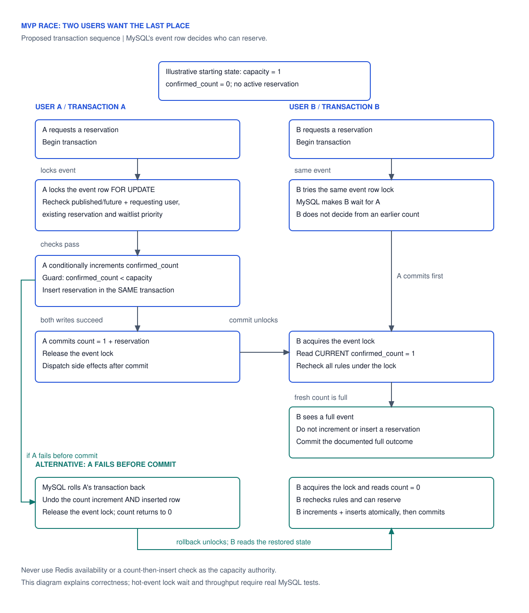
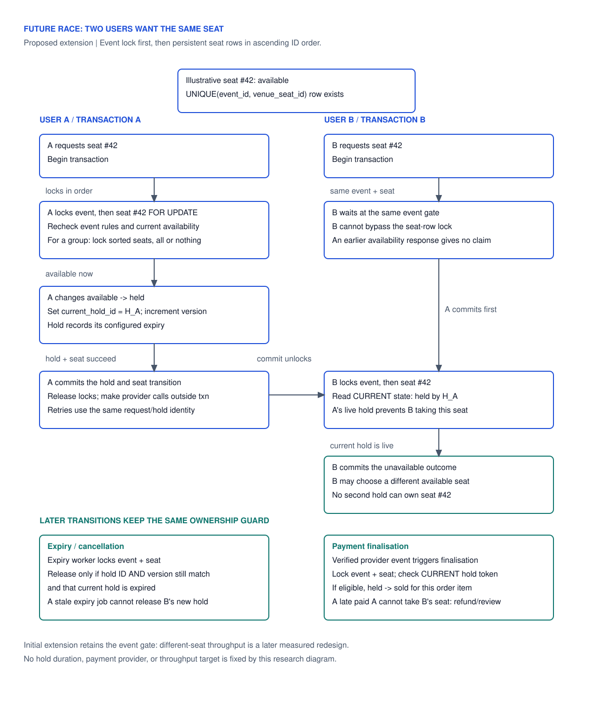

# Reservation races: last place, same seat and retries

This note makes the concurrency design in [the MVP database report](database-design.md) concrete. It is an implementation plan for [#9](https://github.com/GLegg18/LeggTix/issues/9) and [#12](https://github.com/GLegg18/LeggTix/issues/12); no domain tables or working reservation endpoints exist yet.

The MVP reserves one general-admission place, so “last seat” currently means the final unit of event capacity. A named seat such as row A, seat 42 belongs to the [assigned-seating extension](ticketing-extensions.md). Both models rely on MySQL transactions, current reads and guarded writes. Indexes find the row quickly; the transaction prevents two customers from owning the same inventory.

## Two customers request the last place

Assume a published future event with `capacity = 1`, `confirmed_count = 0`, no existing waiter and two authenticated customers, A and B. All reservation writers use the same event-first protocol.



| Step | Customer A / connection A | Customer B / independent connection B | Committed inventory |
| --- | --- | --- | --- |
| 1 | Begin transaction; lock the event by PK with `FOR UPDATE`. | Begin transaction. | Count 0; no reservations. |
| 2 | Re-read current event, eligibility and active-attempt/queue state. | Request the same event lock; wait. | Still count 0. |
| 3 | Guarded increment 0 to 1, then insert A's confirmed reservation. | Still waiting; cannot allocate from a cached or earlier response. | Uncommitted A changes are not a completed booking. |
| 4 | Commit both changes. | Lock becomes available. | Count 1; A confirmed. |
| 5 | Return confirmed after successful commit. | Acquire lock and read current count 1. Guard cannot allocate another place; commit a full outcome without insert. | Count 1; only A confirmed. |

The serialization point is acquiring the event lock; the successful booking becomes durable at commit. If B acquires the lock first, the roles reverse. There is no guarantee that the earliest HTTP request wins: scheduling, lock acquisition and transaction success determine the winner. The waitlist's FIFO policy is a separate accepted-join order.

If A fails between increment and insert, or the insert violates a constraint, roll back the entire transaction. The count returns to 0 and B can win. If the server commits A's booking but the HTTP response is lost, A's retry finds the existing active attempt through the unique generated key and allocates nothing else. That is business duplicate protection; a general request-idempotency contract for future group/payment orders is additional work.

### Allocation sketch

This is illustrative SQL for an action, not a migration or a standalone bypass around authorization. Bind IDs; supply the user from the authenticated actor. Validate queue priority and cross-table eligibility before the increment.

```sql
BEGIN;

SELECT id, status, starts_at, capacity, confirmed_count
FROM events
WHERE id = ?
FOR UPDATE;

-- Current, indexed active-attempt lookup; also inspect active waitlist state.
SELECT id
FROM reservations
WHERE event_id = ? AND active_user_id = ?
FOR UPDATE;

-- Only proceed when the actor is eligible and no FIFO waiter has priority.
UPDATE events
SET confirmed_count = confirmed_count + 1,
    updated_at = UTC_TIMESTAMP(6)
WHERE id = ?
  AND status = 'published'
  AND starts_at > UTC_TIMESTAMP(6)
  AND confirmed_count < capacity;

-- Require affected rows = 1 before inserting the new confirmed attempt.
-- INSERT reservation and update any promoted waitlist attempt here.
-- Any failure => ROLLBACK; successful allocation => COMMIT.
```

MySQL [locking reads](https://dev.mysql.com/doc/refman/8.4/en/innodb-locking-reads.html) require a transaction and provide current data while holding conflicting writes back. A previous plain read or availability cache is not the allocation decision. Check publication/start time again after waiting; never reuse a controller's stale event instance. The SQL time guard checks eligibility at allocation, not a promise that network delivery or commit finishes before the event starts.

`CHECK(confirmed_count <= capacity)` bounds the counter. The transaction must also preserve `confirmed_count = number of confirmed reservations`; a check cannot enforce that cross-table equality. Unique `(event_id, active_user_id)` prevents duplicate confirmed attempts by one customer; it does not prevent two different customers exceeding capacity without the counter/lock protocol.

## Two customers request the same named seat

This is a future design, not an extra MVP table. Create `event_seats` rows before opening the seated occurrence, one per offered venue seat, with unique `(event_id, venue_seat_id)`. The row represents that physical seat for that occurrence; the same venue seat can be sold at another occurrence.



| Step | First customer | Competing customer / worker | Required outcome |
| --- | --- | --- | --- |
| Claim | Lock event, then seat row; check event eligibility and `available`; create hold and change the seat to `held` with its token/version. | Wait for the same lock. | One committed active holder. |
| Compete | Commit and start payment outside DB locks. | Read the now-held seat after locking. | Conflict/choose another seat; no second hold. |
| Release/rehold | Expiry worker releases only if the current token/version still matches the expired hold. | A later customer can create a new hold after valid release. | The old expiry retry cannot free the new customer's hold. |
| Pay/finalize | Verified provider success finalizes only a current, unexpired matching hold, making the seat sold once. | Expiry/finalization competes under the same locks and rechecks current state. | A single seat allocation; failed/repeated attempts add none. |
| Late payment | Original customer's payment succeeds after their hold was released and assigned again. | New customer's current allocation is preserved. | Refund/review the late payment; it cannot steal the seat. |

A hold's duration, payment provider, cancellation/refund policy and finalization cutoff remain feature decisions, not invented defaults. Use authoritative database UTC time after locks when checking expiry. Group orders lock sorted seat IDs and claim all requested seats atomically or release the entire failed attempt; never return a silent partial group. The first extension retains the event lock to coordinate event changes; separate-seat parallel allocation would require a separately reviewed metadata/inventory locking design and load evidence.

Unique seat rows plus current state prevent conflicting ownership. An expiry job must compare `seat id + current_hold_id + version` (and hold deadline/state) before release; matching only a seat ID lets an old job destroy a newer booking. Composite FKs/current transition checks also verify that the hold, order item and seat belong to the same occurrence. Full fields and state checks belong to [the extension plan](ticketing-extensions.md).

## Other races the implementation must cover

| Race | Shared rule | Expected outcome |
| --- | --- | --- |
| Same customer books twice | Event lock plus active-only unique key. | One confirmed attempt; retry/duplicate outcome allocates nothing. |
| Reserve vs waitlist join | Both lock event and check both active tables. | Never both confirmed and waiting. |
| Duplicate cancellation | Transition the exact attempt once; decrement only on `confirmed -> cancelled`. | One freed place and at most one replacement promotion. |
| Cancel, rebook, stale old cancellation | New booking has a fresh ID. | Old request cannot cancel the replacement. |
| New booking vs FIFO promotion | Both allocate through the same event gate; waiters have priority. | Newcomer cannot take a place ahead of eligible queue entries. |
| Capacity edit vs booking | Same event gate and counter guard. | No decrease below occupancy; increases serve the queue. |
| Event cancellation vs booking | Event cancellation closes eligibility/inventory under the same gate. | If booking commits first, cancellation closes it; if cancellation wins first, booking is rejected. |
| Lock timeout/deadlock | Retry the whole transaction only within a bounded budget; no partial success. | Retryable busy/failure outcome, with no duplicate insert or external side effect. |
| Payment callback/expiry/replay | Future hold token/state checks plus idempotent payment/order transitions. | One finalization or explicit compensation; no stolen/extra seat. |

MySQL [deadlock guidance](https://dev.mysql.com/doc/refman/8.4/en/innodb-deadlocks-handling.html) calls for short transactions, consistent lock order and retry handling. A full event is a business outcome; a timeout/busy database is a retryable operational outcome. Exact HTTP codes and client retry behaviour should be recorded when the API is implemented; do not misreport a timed-out lookup as proven sold out.

## Verification plan after implementation

Use real MySQL 8.4, independent database connections/processes and a synchronization barrier. Sequential calls or SQLite-only tests do not demonstrate the lock race. Hold A's transaction open at the allocation point, start B's competing action and observe its wait, then release A by commit or rollback. Inspect committed rows and counters after both requests finish.

1. **Last place, commit:** both contenders start with apparent availability; exactly one is confirmed and the other sees full. Assert count equals confirmed rows and is at most capacity.
2. **Last place, rollback:** fail A after the counter increment; B confirms and there is no count drift or leftover A attempt.
3. **Lost HTTP response / duplicate actor:** retry a committed booking; one active row and no extra count. Run same-actor requests concurrently as well.
4. **Reserve/join/cancel/promotion races:** use the table above; assert exclusivity, holder isolation, FIFO ties and one promotion per freed place.
5. **Named-seat race, future:** two customers select the same `event_seat`; one hold succeeds. Different occurrences may reuse the same `venue_seat`.
6. **Expiry fencing, future:** expire hold A, rehold for B, rerun A's old expiry job; B retains the seat. Race A's success callback against expiry and B's claim; A either finalizes a still-valid hold once or enters compensation.
7. **Group-seat rollback, future:** one requested seat is unavailable; no seat in the group is newly held/sold and no inventory counter is partially changed.
8. **High traffic:** burst one hot event and several different events, inspect query plans, lock waits, deadlocks/retries and latency percentiles. Indexes reduce work under the lock; the one-event serialization limit still needs measurement.

The sketches and diagrams describe expected behaviour. No concurrency experiment, benchmark, payment-provider integration or runnable SQL fixture was executed as part of this research update.
