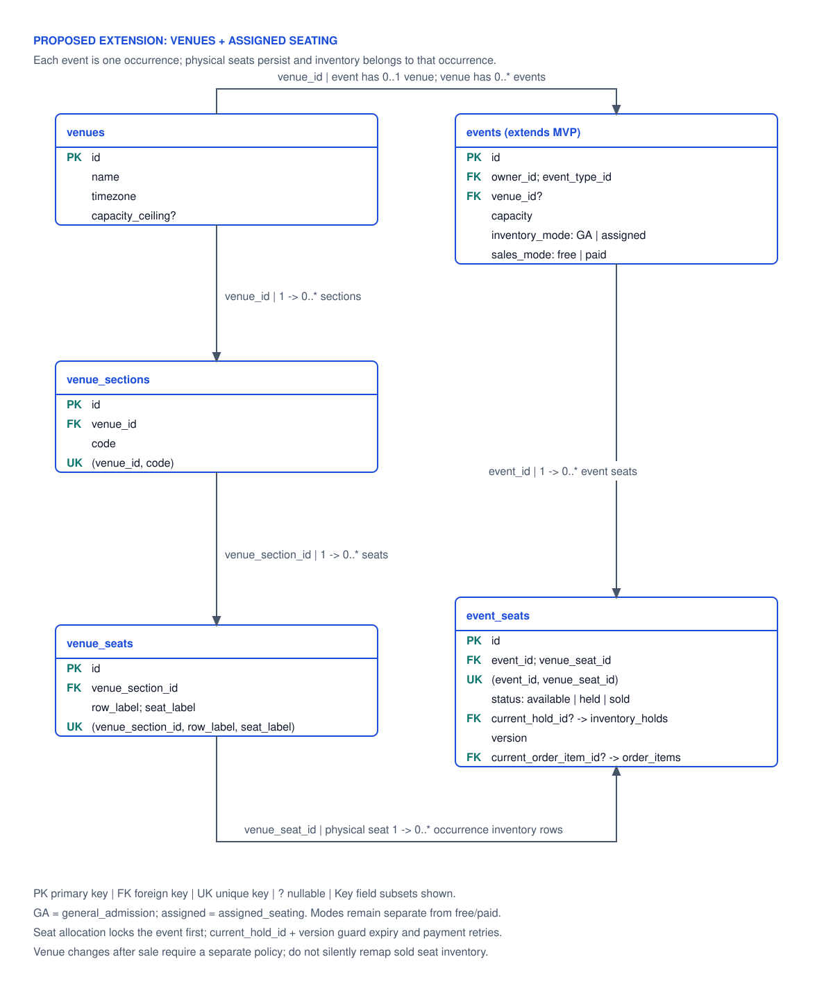
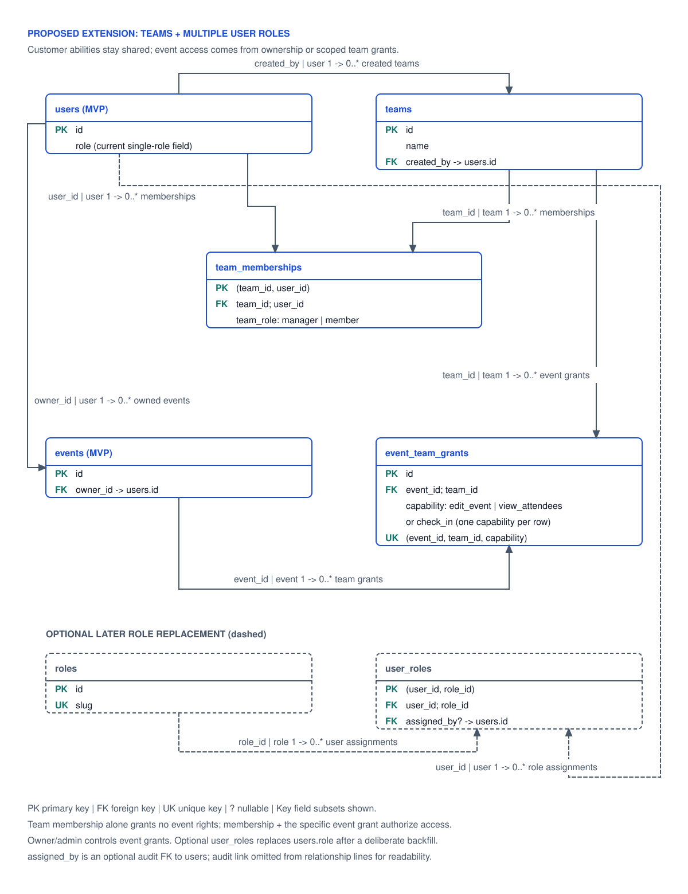
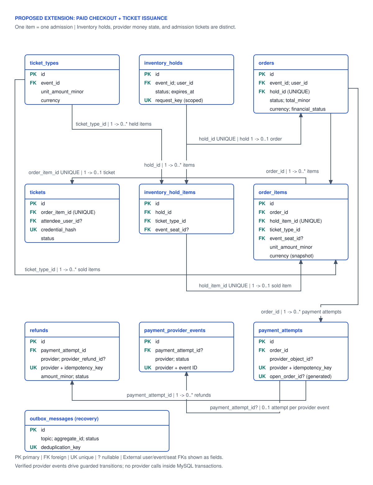

# Ticketing extensions: venues, seats, teams and paid admission

Research date: 6 October 2026. This is a phased design proposal for the follow-up to [#27](https://github.com/GLegg18/LeggTix/issues/27). The [MVP database design](database-design.md) remains five domain tables: `users`, `event_types`, `events`, `reservations`, and `waitlist_entries`. None of the extension tables below has been implemented or tested by this research task.

The useful expansion is a path from free, single-place reservations to a small ticketing product. It does not require building every future table now. Venues and team access can arrive independently; paid general admission introduces a checkout lifecycle; allocated seating then uses that same lifecycle against individual seat rows. A payment is a financial fact, an allocation is an inventory fact, and a ticket is an admission credential. Keeping these separate makes cancellations, retries and refunds understandable.

## Extension map and decision gates

| Phase | Add when the product needs it | Dependency and boundary |
| --- | --- | --- |
| MVP | Free general admission, one place per account per event | Existing five-table proposal; no seats, payment provider or organisation permission engine. |
| Shared venues | Reusable addresses and venue listings | Add `venues`; retain capacity on each scheduled event occurrence. Venue seating is a later addition. |
| Organiser teams | Several people need explicit access to one event | Add `teams`, `team_memberships`, `event_team_grants`; retain `events.owner_id`. Independent of checkout. |
| Independent account roles | A person needs several independent management capability sets | Add `roles`, `user_roles` only when the current role field no longer expresses the required capabilities. Customer booking already works for organisers/admins. |
| Paid general admission | Real checkout, temporary allocation and issued admission credentials | Agree purchase limits, hold duration, cancellation/refund policy, currency and provider first. Introduce checkout tables and reliable recovery. |
| Allocated seating | Customers choose a specific seat for a specific occurrence | Depends on venue layout, persistent `event_seats` and the hold/finalisation protocol. Start with the implemented checkout mode only. |

These are proposed future tickets, not a commitment to include them in the interview MVP. The separate [race-scenario note](reservation-races.md) gives worked last-place and same-seat examples.

### One inventory authority for each occurrence

Keep `events` as one occurrence with one admission pool. Introduce separate `inventory_mode` (`general_admission`, `assigned_seating`) and `sales_mode` (`free`, `paid`) when the first extension needs them; default existing events to general admission/free. Pricing and seating are separate concepts, but accept only combinations with an implemented allocation workflow. A future free seated workflow can reuse zero-price orders/tickets without a provider; it must not also allocate through the old reservation endpoint.

| Implemented mode | Authoritative inventory | Meaning of capacity and counters |
| --- | --- | --- |
| Free general admission | Existing event lock, `events.capacity` / `confirmed_count`, and confirmed reservations written together | Current MVP contract. |
| Paid general admission | Event lock and guarded `held_count` / `sold_count` maintained with holds/order allocations | `held_count + sold_count <= capacity`; expired holds still occupy stock until released transactionally. Prices do not create separate capacity. |
| Assigned seating | One persistent `event_seats` row per offered physical seat per occurrence | Its current state/owner determines availability. Any event totals are derived or diagnostic, never a second allocator. |

Do not sell from `confirmed_count` and a separate checkout counter at once. Freeze mode changes once any reservation, waitlist, hold, order or ticket history exists. Roll out paid/seated modes on new occurrences first; retain the old free-event endpoints/history. Converting a booked event would require a separate, audited migration with explicit inventory reconciliation, not an ordinary event edit.

The paid-GA migration adds `events.held_count` and `events.sold_count` as non-negative `INT UNSIGNED`, default zero, plus a named check bounding their sum by capacity for that mode. Preserve the existing `confirmed_count <= capacity` check for free GA, and require the unused allocator's counters to stay zero for each mode. For assigned seating, capacity is an offered-seat publication snapshot/diagnostic; seat rows decide allocation, and publishing validates the offered-row total instead of allocating from that numeric snapshot. Every writer maintains its mode's counter and allocation records atomically; the bounds alone cannot prove child-row equality.

For the first paid version all ticket prices share one general-admission capacity. A VIP price does not silently reserve its own stock. Independent tier quotas, mixed standing/seated pools, seat bundles and multi-event carts need another explicit inventory design before implementation.

## Shared venues and occurrence seating

[Open the venue/seating diagram](diagrams/leggtix-venues-seating-er.svg). Solid relationships describe the proposed extension; hold/order pointers connect to the later checkout model.

Use the MVP conventions: `BIGINT UNSIGNED` IDs/FKs, UTC `DATETIME(6)`, server-owned transitions, InnoDB, named checks/constraints and restricted deletion of referenced historical data. Opaque provider IDs and credential hashes require exact, case-sensitive comparisons rather than a human-name collation.

| Table/change | Key fields | Constraints and query indexes |
| --- | --- | --- |
| `venues` | `id` PK; `name`; address fields; country code; IANA `timezone`; nullable `capacity_ceiling`; `is_active` | Positive ceiling when present; retire referenced venues. Index location/name only for an actual catalogue query, not every address field. |
| `events.venue_id` | Nullable FK to `venues.id` initially | Index `(venue_id, starts_at, id)` for an occurrence list at a venue. Preserve `events.venue` as display/history text during migration. |
| `venue_sections` | `id` PK; `venue_id` FK; `code`; `name`; `is_active` | Unique `(venue_id, code)`. A section belongs to one venue. |
| `venue_seats` | `id` PK; `venue_section_id` FK; `row_label`; `seat_label`; `is_active` | Unique `(venue_section_id, row_label, seat_label)`. These are physical layout records, not sale inventory. |
| `event_seats` | `id` PK; `event_id` FK; `venue_seat_id` FK; `status`; nullable `current_hold_id`; nullable `current_order_item_id`; `version` | Unique `(event_id, venue_seat_id)`; index `(event_id, status, id)`. `status` is `available`, `held` or `sold`; current pointers/state checks below. |

The venue's building limit is not an occurrence's sale capacity. Layout, stage placement and blocked seats can change how many places are offered. Two screenings at the same venue use different event rows and distinct allocation pools, even if they offer the same physical seat. `venue_seats` describes the reusable layout; `event_seats` describes this occurrence's offered seats and their current allocation.

For the smallest seated model create `event_seats` only for seats offered at publication and freeze that offered layout once sales/holds exist. A later blocked-seat feature needs a distinct non-sale state and a rule preventing removal of a held/sold seat. Renaming or retiring a physical seat must not rewrite historical admission labels; snapshot section/row/seat display labels on purchased order items.

Application publication validation verifies that every offered seat's section belongs to the event's venue. Plain FKs to an event and a physical seat prove that both exist; they do not prove they belong to the same venue. A future layout administration operation must use the same validation and stop moving a referenced seat to a different section/venue. If mutable layouts are required, introduce versioned layouts rather than changing historical seat identity.

### Persistent seat ownership and stale-task fencing

`event_seats` persists after a hold expires or a ticket is cancelled. Do not use a temporary allocation row that disappears as the only record to lock: an available seat still needs a stable row shared by every contender.

| Seat state | Required pointers |
| --- | --- |
| `available` | `current_hold_id IS NULL` and `current_order_item_id IS NULL` |
| `held` | `current_hold_id IS NOT NULL` and `current_order_item_id IS NULL` |
| `sold` | `current_hold_id IS NULL` and `current_order_item_id IS NOT NULL` |

Add enforced row checks for these combinations. `version` increases on every ownership transition. Hold items snapshot the seat version obtained during acquisition; sold order items record the final allocation version. A release/finalisation compares the expected pointer **and** version under the seat lock. An old expiry job for hold A must never clear hold B, and a late payment for order A must never take the seat now held/sold to B.

For the first implementation retain the event-row gate, then lock the requested `event_seats` rows in ascending ID order with current locking reads. Revalidate publication/start cutoff after locks, require all seats to be available, write one hold and its items, and set all requested seat pointers/version in one transaction. If any seat fails, roll back the whole request. Never hold locks while waiting for payment or making a provider request. MySQL documents that [`FOR UPDATE` reads current data and holds conflicting row locks until transaction completion](https://dev.mysql.com/doc/refman/8.4/en/innodb-locking-reads.html).

The common event gate keeps cancellation, publication and inventory operations consistent; it also serialises purchases for different seats at one hot event. Indexes shorten the gate's duration. Removing that gate for independent-seat throughput requires a measured design for event closure, lock order and publication races; it is a later optimisation, not an assumed property of this proposal. Ordinary read replicas/cache seat maps remain advisory.

Migration order: add venue catalogue and nullable event link; curate/backfill existing text deliberately (do not merge distinct venues merely because names match); add sections/physical seats; add persistent event seats; add hold/order references after checkout parents exist. Keep legacy venue text until every display/history path has a clear source. No existing reservation becomes a paid or seated purchase automatically.

## Organiser teams and overlapping account roles

[Open the team/role diagram](diagrams/leggtix-teams-roles-er.svg). The optional role mapping replaces the current role field after migration; it is not a competing source of authorization.

### An organiser can already also be a customer

The current proposal uses a checked `VARCHAR` and PHP backed enum, not a MySQL native enum: `regular_user`, `organiser`, `admin`. Those slugs describe management privileges. All three can book, join a waitlist and cancel their own attempts. Someone who occasionally organises events does not need two accounts or two role rows just to remain a customer.

The role field becomes insufficient when there are independent management privileges, such as an organiser who also does system moderation, or an account with independently revocable administrative duties. Event ownership and team grants remain separate resource scopes. A global role never means every event is owned by that user.

| Proposed table | Fields / keys | Rule |
| --- | --- | --- |
| `teams` | `id` PK; `name`; `created_by` FK to users | Lightweight organiser group; not yet a legal merchant or payout recipient. |
| `team_memberships` | Composite PK `(team_id, user_id)`; both FKs; `team_role` (`manager`, `member`); timestamps | Index `(user_id, team_id)` for a user's teams. Managers administer membership, not arbitrary events. |
| `event_team_grants` | `id` PK; `event_id` FK; `team_id` FK; `capability` | Unique `(event_id, team_id, capability)`; reverse index `(team_id, event_id, capability)`. Initial capability catalogue: `edit_event`, `view_attendees`, `check_in` when that feature exists. |
| Optional `roles` | `id` PK; unique `slug`; display name | Start with the existing trusted capability definitions. Adding a label does not dynamically grant arbitrary permissions. |
| Optional `user_roles` | Composite PK `(user_id, role_id)`; FKs; nullable `assigned_by` FK users for seed/backfill; `assigned_at` | Index `(role_id, user_id)` for role administration. Privileged assignment/removal is server-authorised. |

Authorization requires membership **and** a matching grant for that event. For this proposed extension, a regular account may receive narrowly delegated metadata editing, attendee viewing or check-in without gaining the global organiser role. Team manager status alone does not allow editing every event, viewing another team's attendee list, granting privileges on an unowned event or creating an event without organiser capability. Only current owner with organiser capability/admin assigns or revokes event-team grants. Keep publication, event-wide cancellation and ownership transfer owner-with-organiser-capability/admin-only in the first team version; `edit_event` initially covers explicitly allowed metadata edits. A grant for `view_attendees` does not imply editing or check-in.

Keep `events.owner_id` as the accountable owner. Retiring a team/removing membership must not orphan event ownership. Membership/grant revocation takes effect on subsequent operations; sensitive mutations revalidate current membership/grants in their transaction, rather than authorising from a stale cache. Use current locking reads of the relevant authorization rows in a fixed order after the event gate, and have revocation update those same rows without later acquiring event locks in reverse order. Laravel [Policies](https://laravel.com/framework/docs/13.x/authorization) are the application enforcement point; these tables do not enforce object access on their own.

An organisation entity is only justified once there are company profiles, legal ownership or payouts. It can later own teams, but membership in a company must not silently broaden event grants. Per-user exceptions, invitation flows, member suspension and team-owned events need explicit rules when requested; do not add a generic editable role/permission engine now.

For a future role migration: create/seed roles; backfill one role mapping matching each current management role; preserve shared customer capabilities; deploy Policy reads against mappings; verify parity with role/ownership tests; then remove `users.role` and its old check in a later migration. During deployment use one documented authority and a short controlled compatibility write path, not two independently editable role sources. Losing organiser capability prevents future event creation and owner-based management even if an event still references that user; preserve admin recovery and history. Explicit team grants remain a separate delegated route until revoked. If demotion is intended to remove all management access, the admin operation must also revoke the relevant grants/memberships; changing a global role alone cannot promise that result.

## Paid admission: holds, orders, provider facts and tickets

[Open the checkout diagram](diagrams/leggtix-paid-checkout-er.svg). Seat pointers are described above. A durable inbox/outbox supports retries and recovery; it does not replace inventory locks.

The proposed first checkout has one authenticated purchaser, one occurrence, one currency, and one admission per order item. A purchaser can buy for others only after the quantity/attendee policy is approved. This changes the MVP's one-active-reservation-per-user rule: never quietly remove that uniqueness and claim group checkout is equivalent. Buyer purchase limits, named attendees and waitlist fairness are separate decisions.

Stripe is a reference provider for research, not a selected integration. Its [payment object lifecycle](https://docs.stripe.com/payments/payment-intents) is useful vocabulary; hosted Checkout versus another integration/provider remains a ticket decision. The schema stores provider references and verified outcomes, never card numbers, CVCs or authentication secrets. Amounts/currency come from the server's frozen order, not a client request or untrusted provider metadata.

### Proposed checkout tables

All rows have the standard timestamps. The table below lists the business keys; `event_id` repeated on hold/order items allows occurrence-scoped composite FKs. Add matching named `UNIQUE(event_id, id)` parent keys where those composite FKs require them.

| Table | Minimum fields and relationships | Checks / uniqueness / hot-path index |
| --- | --- | --- |
| `ticket_types` | `id` PK; `event_id` FK; label; `unit_amount_minor`; `currency`; `is_active`; optional sale start/end | Non-negative integer minor units; valid currency; valid sale window. `(event_id, is_active, id)`; no independent tier capacity initially. |
| `inventory_holds` | `id` PK; `event_id` FK; `user_id` FK; `status`; `expires_at`; nullable `consumed_at`, `expired_at`, `released_at`; `request_key`; request payload hash | States `active`, `consumed`, `expired`, `released`; immutable expiry initially. Unique `(user_id, request_key)`; `(status, expires_at, id)` for bounded sweeps; `(event_id, status, id)` for diagnostics. |
| `inventory_hold_items` | `id` PK; `event_id`; `hold_id`; `ticket_type_id`; nullable `event_seat_id`; nullable `seat_version` | One row per held admission. Composite FKs to same-event hold/type/seat. Unique `(hold_id, event_seat_id)` prevents repeating a selected seat within a hold while allowing several NULL-seat GA items. `(hold_id, id)` for bounded item loading. |
| `orders` | `id` PK; `event_id` FK; `user_id` FK; `hold_id`; fulfilment `status`; `financial_status`; frozen `total_minor`; `currency` | Unique `hold_id`: at most one order for a hold. Composite same-event hold FK. `(user_id, created_at, id)` for purchase history; `(status, updated_at, id)` for recovery. |
| `order_items` | `id` PK; `event_id`; `order_id`; `hold_item_id`; `ticket_type_id`; nullable `event_seat_id`; nullable final `seat_version`; snapshot label, seat labels, `unit_amount_minor`, `currency` | Unique `hold_item_id`; same-event composite FKs to order/hold-item/type/seat; `(order_id, id)`. One row is one admission, so quantities are not duplicated in both a line and ticket rows. |
| `payment_attempts` | `id` PK; `order_id` FK; provider; nullable provider payment/session reference; `idempotency_key`; `status`; generated nullable `open_order_id`; expected amount/currency; verified completion time | Unique `(provider, idempotency_key)` and `(provider, provider_object_id)` when present; unique `open_order_id` for one unresolved operation per order. `(order_id, id)`; recovery `(status, updated_at, id)`. A local operation survives unknown network outcomes. |
| `payment_provider_events` | `id` PK; provider; provider event ID; nullable routed `payment_attempt_id`; event type; `received_at`; `status`; processing/retry data | Unique `(provider, provider_event_id)`; `(status, received_at, id)` for recovery. Verify signature before persisting/accepting; store only necessary payload/identifiers with a retention policy. |
| `refunds` | `id` PK; `payment_attempt_id` FK; provider; nullable provider refund ID; `idempotency_key`; `amount_minor`; reason; `status` | Positive amount; unique `(provider, idempotency_key)` / provider refund ID within provider scope; `(payment_attempt_id, id)`. Multiple partial refunds are possible; do not make payment FK unique. |
| `tickets` | `id` PK; `order_item_id` FK; nullable `attendee_user_id` FK; `status`; random credential hash; optional check-in time | Unique `order_item_id` and credential hash. States `issued`, `voided`, `checked_in`; private credential handling; `(attendee_user_id, created_at, id)` if attendee history is implemented. |
| `outbox_messages` | `id` PK; topic; aggregate identity; `deduplication_key`; `status`; next attempt time; delivery data | Unique deduplication key; `(status, next_attempt_at, id)`. Write inventory/payment side-effect intents in the same local transaction; bounded workers/recovery commands retry them. |

Use binary/case-sensitive provider identifiers. Initially scope all payment references to one sandbox merchant account. If live mode, multiple merchant accounts or Connect-style payouts are later supported, add account/environment to **every** provider-reference/idempotency uniqueness scope before enabling them; these are not just more team roles.

Composite FKs prevent, for example, a hold for event A from referencing a ticket type/seat in event B. A plain `event_seat_id` FK is insufficient. They still do not prove that an order item's hold item belongs to that order's specific hold, that the buyer matches the hold's user, or that a seat is currently held by that hold. The locked checkout action checks those relationships explicitly. Also add composite `(event_id, current_hold_id)` and `(event_id, current_order_item_id)` seat-pointer FKs after the referenced tables exist. Constraints are guardrails; current pointer/version checks are the allocation protocol.

The amount on an order item is a snapshot. A later price or label edit must not alter an already quoted purchase; order total is the checked server sum of frozen items in one currency. These are cross-row rules, not a `CHECK` subquery. Fees, discounts, tax, settlement and chargeback accounting are separate features; this proposal is not a full financial ledger.

### Local state boundaries

Use checked status slugs plus PHP enums rather than accepting arbitrary provider strings as local business state. Provider-specific statuses may be recorded as diagnostic facts, then mapped through verified transitions.

| Local record | Proposed states and boundary |
| --- | --- |
| Hold | `active -> consumed`, `expired` or `released`; terminal attempts do not reactivate. Require `expires_at > created_at`; active has all three terminal timestamps NULL, each terminal state has only its corresponding `consumed_at`, `expired_at` or `released_at` set. |
| Order fulfilment | `awaiting_payment -> fulfilled`, `expired` or `cancelled`; a late payment never changes an expired/cancelled order into fulfilled. |
| Order finances | `unpaid`, `paid`, `partially_refunded`, `refunded`, `review`; actual payment/refund rows determine transitions, independent of fulfilment. A successful unfulfillable payment enters review with durable compensation work. |
| Payment operation | `creating`, `pending`, `succeeded`, `failed`, `review`; unknown provider response remains pending/review until reconciliation. Do not infer failure from HTTP timeout or reverse verified success on an older failure event. |
| Provider inbox | `pending`, `processing`, `processed`, `review`; an expired processing lease is recoverable. Delivery dedupe does not replace order transition guards. |
| Refund operation | `pending`, `succeeded`, `failed`, `review`; pending and unresolved review operations retain their reserved amount until provider reconciliation resolves uncertainty. Only definitively failed/reconciled non-refunds release that allowance. Retry the same operation, not a new unconstrained refund row. |
| Outbox operation | `pending`, `processing`, `delivered`, `review`; retry with durable operation identity and bounded backoff; reclaim abandoned processing leases. |

Name/validate terminal timestamps and recovery lease fields in the implementation migration. A lease claims work; it never proves a seat is available. Unresolved review rows need an operator list and recovery action before paid admission is enabled.

One order can retain several historical payment attempts, but only one unresolved provider-create/payment operation. Generate `open_order_id = CASE WHEN status IN ('creating', 'pending', 'review') THEN order_id ELSE NULL END` and uniquely index it. The locked order action also refuses a new charge operation once any verified payment has paid that order, including after refunds or an order-level review state. Reuse/reconcile the current provider object during uncertainty; begin another attempt only after definitive failure/cancellation and while the order/hold remain eligible. A timeout or retryable payment-failure callback alone does not release this guard. Record a verified extra payment attempt as `succeeded`; its refund/order-review work is separate, so a known success does not consume the unresolved-operation key.

### Checkout and recovery protocol

1. **Acquire inventory.** Validate a bounded item count and server-side price eligibility. Lock event first, and seat rows in ascending ID order where applicable. Re-read eligibility and current allocation; create a new active hold/items. For paid GA increment `held_count` with `held_count + sold_count + requested <= capacity`; for seats set current hold/version. Create frozen order/items and a durable provider-create operation/outbox intent in the same transaction. Repeating the same user request key returns its existing hold/order; a different payload with that key fails. Commit.
2. **Call the provider outside the transaction.** A worker or post-commit action creates/resumes the provider payment/session using the persisted operation key. Persist the returned provider ID afterwards. An ambiguous timeout becomes reconciliation work using the existing local operation, never a reason to silently start another charge. Keep secrets and client-facing payment capabilities out of logs/URLs.
3. **Receive provider facts durably.** Verify the raw-body signature, persist/deduplicate the inbox record, and acknowledge only after durable acceptance. Process asynchronously with a bounded worker; a scan/recovery command finds unprocessed records if enqueue fails. Invalid signatures cause no state/inventory change.
4. **Finalise only a valid current allocation.** After resolving provider state outside DB locks if necessary, take event/seat locks and then hold/order/payment locks in the documented order. Match local order, provider scope/reference, amount and currency. Revalidate published/future event eligibility and get current UTC time after waiting for locks. Require the hold still active/unexpired and current seat pointer/version matching each hold item. Atomically consume the hold, convert GA `held_count` to `sold_count` or set seats to sold/current order item with new version, update financial/fulfilment states, and issue one ticket per item. Notifications enter the outbox. Repeated success for the same provider payment object is a no-op with the existing result. A second distinct successful provider object for that already-paid order is an extra payment fact: record it once, allocate/issue nothing further, and create durable refund/review compensation for that specific extra attempt. A fulfilment no-op must not hide a second charge.
5. **Expire or release safely.** The sweeper/explicit cancellation rechecks current UTC time/state after obtaining the same inventory locks and conditionally releases only the current hold. For GA decrement held stock once; for seats clear only the matching hold/version. Close pending order fulfilment and record provider cancellation/reconciliation intent. Jobs can run late or twice safely; a retry for the old hold cannot release new ownership. Lazy bounded reclamation on a later purchase can complement scheduled sweeps.
6. **Compensate late success.** If a verified successful payment arrives after expiry/release/event cancellation or the finalisation start cutoff, record the financial success and financial review/refund-required outcome, issue no ticket, and enqueue one durable refund/reconciliation operation. Never revive the hold or seize a reallocated seat. A refund failure remains visible for manual review. The provider and MySQL cannot commit one distributed transaction; this compensation path is required.

Use one fixed lock order for all allocation/finalisation/expiry/cancellation/refund-release actions: event gate; seat IDs ascending if present; then hold, order and payment rows consistently. Routing reads may identify candidates before that transaction, but cannot authorize a transition. Do not hold an inbox-processing claim transaction or provider call open while waiting for inventory. Laravel supports [transaction closures and bounded deadlock retries](https://laravel.com/framework/docs/13.x/database#database-transactions); retry the whole local state calculation with no external calls in the retry closure.

Stripe warns that [webhooks can repeat and arrive out of order](https://docs.stripe.com/webhooks). Unique event IDs only deduplicate the same delivery: different provider events can describe the same payment success. Local terminal-state guards and unique order-item tickets prevent a second allocation/issuance. A failure callback must not undo an already verified paid/finalised order; when facts conflict, reconcile the provider object outside DB locks and guard the local transition again.

Provider [idempotency keys](https://docs.stripe.com/api/idempotent_requests) support safe request retries, but Stripe can discard keys after at least 24 hours. A durable local operation ID, stored provider object ID and reconciliation are still required for a retry after that window. No design here promises exactly-once network delivery; it aims for once-only local business effects and recoverable external operations.

### Refunds, tickets and inventory release are distinct

An approved refund creates a separate financial operation. Lock the payment/order to reserve the refund amount, counting successful refunds plus **all unresolved reservations** (`pending` and `review`), before making the provider call with its stable key. Moving an uncertain operation to review does not release its allowance; release only after a definitive provider failure/cancellation or reconciliation proving no refund occurred. A new/restarted provider operation must reacquire allowance. Prevent cumulative reserved/settled refunds above the verified paid amount. Persist/verify provider outcomes and keep uncertain failures recoverable. Stripe permits [partial refunds up to the remaining paid balance](https://docs.stripe.com/api/refunds/create); this is why a payment can have several refund rows.

A refund does not automatically make a seat available. The policy might refund a fee, compensate a customer who attended, or cancel an admission. Only a separate authorised ticket-cancellation/allocation-release transition voids the corresponding credential and decreases `sold_count` or clears the matching seat/order-item/version. Keep sold occupancy if admission remains valid, even if finances are partly/fully refunded. Releasing after check-in/event start requires an explicit rule, not a casual refund endpoint. Event-wide cancellation must close admission, prevent new checkout/finalisation and schedule refunds in recoverable batches; it must not hold a DB transaction across provider calls.

Use unguessable admission credentials, store their hash, and return them only to authorised holders. A future check-in operation locks the ticket and accepts only the first `issued -> checked_in` transition; duplicate scans return the existing result. Check-in staff require an event-scoped grant. Transfer/reissue and purchaser-versus-attendee privacy need separate policies before exposure.

### Paid waitlists cannot auto-charge

The MVP waitlist consents to automatic **free** promotion. For paid admission, promotion should create an expiring checkout offer/hold and notify the next eligible waiter; accepting it completes checkout. Expired offers release inventory and advance the queue under the common inventory protocol. This needs new waitlist states/offer links, a decision on offer duration and retry eligibility, and rules for requested quantity/seat preferences. Until that feature is implemented, disable the MVP auto-confirm path on paid/seated events. A waitlist record is not authorization to charge a saved payment method.

## High-traffic implications

The added model keeps the contested operation short: indexed PK/current ownership lookup, bounded item list, guarded state transition, commit. Hold-expiry/inbox/outbox scans use status/time/ID indexes and bounded batches, not a scan of every order during checkout. Customer history and venue/event lists use cursor pagination. Avoid indexing every amount/status combination or adding mutable JSON as the inventory source.

The event gate is intentionally a hot row for one popular occurrence. Extra indexes improve lookup/lock duration, not simultaneous writes to that same gate. Measure independent-process bursts on one occurrence and several different occurrences; inspect query plans, connection saturation, deadlocks/retries, lock wait time and p95/p99 latency. Bound HTTP/queue/database concurrency and rate-limit abusive hold creation. Do not promise a requests-per-second target without a workload and measurements.

Before introducing independent tier pools or removing the event gate for distinct seats, specify how publication/event cancellation, total caps, FIFO offers, group all-or-nothing allocation and lock ordering stay correct. MySQL remains the writer authority; read replicas and Redis availability are hints. Exact revenue/attendee reporting can be separate indexed/read-side queries and must not lengthen allocation transactions.

## Phased migration and implementation order

1. Deliver/test the five-table free reservation workflow first, including real MySQL last-place/cancel/promotion races and counter reconciliation.
2. Add venue catalogue independently. Backfill links deliberately and keep existing history/text available; introduce seating layout only once selection is required.
3. Add explicit team grants independently. Keep owner identity and verify no widening of event access. Introduce role mappings only if a new independent permission requirement justifies them.
4. Approve paid product rules. Add mode defaults and checkout schema in FK order: types/holds; order parents; seat rows where needed; hold/order items; payment/inbox/refund/tickets; outbox. Some seat-pointer FKs form creation-order cycles and must be added after all targets exist. Ship on new occurrences behind the chosen mode boundary.
5. Implement inventory holds and deterministic expiry before provider checkout; test recovery/duplicate actions. Add verified sandbox provider integration, inbox/outbox recovery, late-success compensation and ticket issuance. Do not enable paid sales without visible unresolved-payment/refund recovery.
6. Add occurrence seat snapshots, all-or-nothing multi-seat holds and stale-version protections. Run same-seat and expiry-versus-success races on real MySQL. Retain the event gate until measurements and a separate review justify changing it.
7. Extend paid waitlist offers only after policy is agreed; preserve free-event FIFO behaviour. Add admission/check-in or transfer only when requested.

## Acceptance cases and manual review plan

These are future implementation tests/expected outcomes, not checks already executed. Concurrency tests need separate MySQL 8.4 connections/processes plus a barrier to overlap operations; SQLite tests cannot establish this locking contract. Use provider sandbox/test doubles with explicit replay, timeout and delayed-response controls.

| Exercise | Expected committed outcome |
| --- | --- |
| Link two occurrences to one venue/seat layout; buy the same physical seat for different occurrences | Independent `event_seats` records; neither occurrence affects the other's inventory. |
| Submit a seat from a different venue or a hold/type/order item from a different occurrence | Scope validation/composite constraint rejects it; no hold, counters or sale survive. |
| Two buyers request the same seat simultaneously | Exactly one current hold; other receives unavailable outcome. No provider charge is started for the losing hold. |
| Two GA buyers compete for the last paid place | Exactly one hold; `held_count + sold_count` never exceeds capacity. |
| Request several seats, with one unavailable; reverse requested seat order in another request | Whole request fails without partial ownership; sorted lock order and bounded deadlock retries preserve consistency. |
| Replay hold request key with identical/different item payload | Identical returns original outcome; different payload is rejected without another hold. |
| Expire hold A, acquire hold B, replay A's expiry job or A's late success | B's pointer/version remains intact; A releases nothing further and late payment becomes refund/review, not a ticket. |
| Payment success races with expiry, event cancellation or a start cutoff | One valid local terminal outcome under current locks; no oversell/reallocated-seat theft; any unfulfilled successful payment has a durable compensation record. |
| Deliver the same webhook twice, then a second provider event for the same success, then an older failure | One finalisation/ticket per item; old failure does not undo paid allocation. |
| Try concurrent provider-create attempts for one order; deliver a distinct second successful provider payment object after the first has paid it | One unresolved local operation; verified extra success is recorded with refund/review work, no extra allocation/ticket and no silent financial loss. |
| Send invalid signature, wrong amount/currency or mismatched payment reference | No inventory/ticket change; invalid delivery rejected or verified mismatch sent to visible review. |
| Crash after hold/order commit, provider creation response, inbox acceptance or ticket issue | Recovery uses persisted operation/provider IDs and inbox/outbox records; no silent second payment, duplicate ticket or permanently invisible pending work. |
| Submit two simultaneous partial refunds whose sum exceeds payment; move an uncertain first operation to review and retry the second | Guarded total including pending and unresolved review reservations prevents over-refund; provider calls occur after commit. |
| Refund without admission cancellation; then separately void/release an eligible ticket twice | First keeps sold occupancy; authorised release changes allocation once and invalidates admission; retry cannot release a newer sale. |
| Remove a team member/grant; attempt event edit, attendee view and check-in | Revoked scope no longer permits operation; unrelated granted scopes still obey their own capability. |
| Make an organiser/admin customer booking; migrate role field to mappings; supply privilege fields at registration | Customer capabilities continue; role parity holds; request-writable fields cannot grant privileges. |
| Use a team manager role or another event's ID to access an ungranted event | Authorization denies without private attendee data or mutation. |
| Attempt MVP free auto-promotion/reservation endpoint on a paid/seated occurrence | Mode guard rejects it; checkout stock has only one allocation authority. |
| Burst holds/checkouts/expiry across one hot occurrence and several independent occurrences | Report actual query plans/latency/lock waits; all counters, current pointers and issued items reconcile after recovery. |

For the research deliverable, open the three extension diagrams and compare their relationships/key fields to this document. Expect the existing five-table model to remain the MVP; physical seats to differ from occurrence allocations; roles to be optional replacements; teams to require explicit event grants; and payments/tickets to have their own lifecycle. Review the [race examples](reservation-races.md) for two contenders and stale expiry. Implementation tests above should later become an acceptance suite and an operator recovery walkthrough.

### Backlog handoff scopes

The coordinating research task creates the linked GitHub work items; their implementation criteria must remain unchecked until the corresponding work is delivered. These scopes should be labelled/stated as post-MVP proposals and depend on the proven core allocation flow.

| Proposed work item | Scope and dependency |
| --- | --- |
| [#28: Shared venues and immutable seat layout](https://github.com/GLegg18/LeggTix/issues/28) | Venue catalogue/backfill, occurrence venue validation, sections/physical seats; no new allocator until seating is introduced. |
| [#29: Organiser teams and event grants](https://github.com/GLegg18/LeggTix/issues/29) | Explicit membership/capability checks, grant/revoke authorization, owner continuity and no global access expansion. |
| [#30: Optional independent role mappings](https://github.com/GLegg18/LeggTix/issues/30) | Decision-gated role need, parity/backfill/cutover tests; retain organiser/admin customer capabilities. |
| [#32: Paid GA holds and orders](https://github.com/GLegg18/LeggTix/issues/32) | Product-rule decisions, one stock authority, frozen prices, request idempotency, deterministic expiry and reconciliation. |
| [#33: Provider payments and refund recovery](https://github.com/GLegg18/LeggTix/issues/33) | Verified/durable inbox, guarded finalisation, late-payment compensation, partial-refund guards and visible recovery; depends on holds/orders. |
| [#34: Allocated occurrence seats](https://github.com/GLegg18/LeggTix/issues/34) | Persistent rows, cross-occurrence checks, sorted all-or-none locks and stale hold/allocation fencing; depends on layout and checkout. |
| [#35: Issued admission tickets and check-in](https://github.com/GLegg18/LeggTix/issues/35) | Once-only item issuance, private credential hashes, duplicate-scan protection and scoped staff access; depends on order finalisation. |
| [#31: Durable outbox and recovery](https://github.com/GLegg18/LeggTix/issues/31) | Persisted side-effect intents, bounded retry/lease handling and repair scans; required before promising reliable paid side effects. |

The existing [#12 race-test work item](https://github.com/GLegg18/LeggTix/issues/12) carries the worked last-place/retry cases and points to the future same-seat tests, rather than duplicating general concurrency work. Extension-specific tests remain in the corresponding stretch tickets.

## Decisions still required before implementation

| Decision | Why it matters / proposed starting boundary |
| --- | --- |
| Purchase quantity, per-account limits and attendees | Group purchase changes the one-active-reservation rule. Start one occurrence/currency and one admission per item; choose a small explicit item cap. |
| Provider/integration and payment methods | Select sandbox first; hosted checkout choice is not fixed by this schema. Long-running/asynchronous methods need a hold/late-success policy. |
| Hold/offer duration, renewals and anti-hoarding | Use server time, immutable expiry initially, bounded cleanup and rate limits; choose the duration before enabling sales. |
| Refund/cancellation/reschedule policy | Specify financial and admission effects separately, including checked-in/past tickets and late successful payments. |
| Seats/layout changes and accessibility | Freeze offered layout after allocation; decide blocked/reserved/accessibility and seat-switch policies before adding mutable seating. |
| Team invitation/ownership recovery and new roles | Explicit grants first; clarify membership removal, owner demotion and any future company/payout authority. |
| Paid waitlist quantities/seat preferences/fairness | Offer/acceptance differs from free auto-confirmation; no saved-card auto-charge or queue bypass. |
| Retention, credentials and provider-event storage | Bound private payload retention, protect admission secrets and keep financial reconciliation sufficient without storing card data. |
| Reliability/service target | Define measured burst workload and recovery expectations; notification/provider recovery needs inbox/outbox scans, not only after-commit enqueue. |

No migration, provider integration, payment, PHPUnit/concurrency/load experiment or production capacity claim is part of this research. The proposed new tickets should preserve these decision gates and dependencies. The unavoidable external-state gap is visible: a payment can succeed after local inventory is gone, so compensation and manual review must exist before paid sales are enabled.

## Research review and handoff status

Created GitHub [#28](https://github.com/GLegg18/LeggTix/issues/28) through [#35](https://github.com/GLegg18/LeggTix/issues/35) as open P2/stretch work, with unchecked implementation criteria and explicit dependencies/activation gates. Updated [#5](https://github.com/GLegg18/LeggTix/issues/5), [#9](https://github.com/GLegg18/LeggTix/issues/9), [#12](https://github.com/GLegg18/LeggTix/issues/12) and [#27](https://github.com/GLegg18/LeggTix/issues/27) with role and concrete-race handoffs. The five-table MVP schema contract remains the initial implementation target.

Security-review findings fixed in this proposed contract: finalisation now rechecks event/start eligibility; global organiser demotion and delegated team grants have distinct effects; unresolved refund review retains its reserved allowance; refund provider and hold terminal fields are explicit. These were documentation defects with risks of late allocation, unintended access or over-refund, not reproduced application bugs. A follow-up review accepted the unresolved-payment unique guard and separate compensation for a distinct second successful charge.

Tester findings fixed: clarified concurrent provider-create/extra-payment handling; corrected the last-place diagram's accessible text from incrementing capacity to incrementing `confirmed_count`; matched nullable venue capacity and financial-status fields in the diagrams. Local links/Markdown structure, XML, generator correspondence, text-fit/bounds/contrast checks and visual review passed. The five SVGs have rendered PNG previews and a standard-library regeneration script at `docs/diagrams/render_expansion_diagrams.py`; `--preview` uses an existing optional Node/sharp runtime. Font substitution may change measured appearance.

No runtime security audit, migration execution, Policy/API tests, actual MySQL races, provider sandbox checkout/refund, PHPUnit, static analysis or throughput test was run. The future acceptance matrix above specifies expected outcomes. Remaining product decisions are explicit activation gates; remaining operational risks are one-event lock contention, provider/local state disagreement and durable recovery work until those features are implemented and exercised.

For manual artifact review, open [the documentation index](README.md), follow each of its five diagram links, and compare the figures with this note and [the race trace](reservation-races.md). Expect the last-place loser to re-read full state, expired hold retries to preserve a new holder, team access to require an event grant, and same-object payment replay to differ from a second distinct charge. Then inspect #28–#35: all should remain future/stretch and unchecked. No Docker, card data or seed accounts are required for this research review. Running the future acceptance cases is a separate implementation task.
