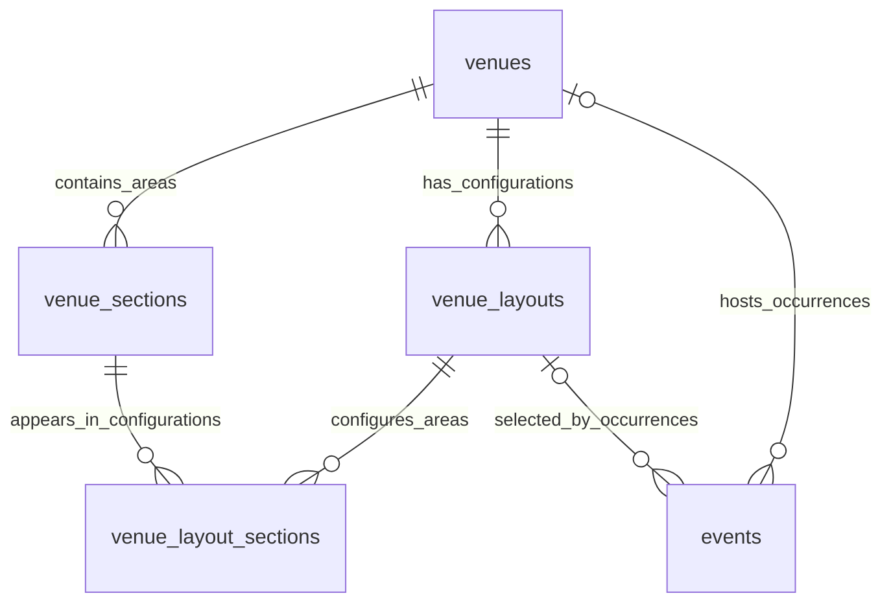

# Venue configurations and event capacity

Design refinement: 8 October 2026, for [#28](https://github.com/GLegg18/LeggTix/issues/28). This extends the [future ticketing plan](ticketing-extensions.md); it does not add migrations or change the five-table MVP. The user highlighted stadium events where a stage closes a stand and a concert can use the pitch for standing admission.

## Three different capacity concepts

| Record | Purpose | Capacity meaning |
| --- | --- | --- |
| `venues` | Reusable name, description, address, country, timezone and optional coordinates | Nullable `capacity_ceiling` only if it is a known upper bound across all supported configurations. A football seating figure must not be treated as that universal ceiling. |
| `venue_layouts` | A specific configuration/revision, such as football, end-stage concert or theatre | Positive `approved_capacity`: the total permitted for this configuration, maintained by authorised catalogue administrators. |
| `events` | One scheduled occurrence choosing a configuration | `capacity`: how many admissions this event offers, at most the chosen configuration's approved capacity. Existing allocation rules still determine available stock. |

An organiser can offer fewer places than the configuration allows. Increasing an event above its current configuration's limit requires selecting or approving a suitable configuration; an event capacity edit cannot bypass that limit. A concert may exceed the venue's football seating capacity without exceeding its concert configuration limit or a genuine universal ceiling.

Wembley's own [concert entry guidance](https://wembleystadium.com/news/2026/09/08/12/43/Diljit-Dosanjh) distinguishes pitch standing, pitch seated and stadium-level seating. This supports modelling areas and event configurations separately; it does not establish capacity figures for our fixtures.

## Optional sections when detailed layouts are needed

Use existing physical `venue_sections` for named stands, blocks, pitch or floor zones. Add a `kind` only if distinguishing stands from other areas is useful. Derive the number of stands from those records instead of maintaining a second `stand_count` that can disagree with them. Areas in a configuration must be non-overlapping: a whole stand and all its child blocks cannot both contribute to the capacity total.

| Table/change | Proposed fields and constraints |
| --- | --- |
| `venues` | Add nullable description and explicit address fields; optional latitude/longitude must be supplied as a valid pair. Keep an IANA timezone. |
| `venue_layouts` | `id`, `venue_id`, `name`, `revision`, `approved_capacity`, `status` (`draft`, `approved`, `retired`), timestamps. Unique `(venue_id, name, revision)` and `(venue_id, id)` for scoped FKs. Approved revisions and revisions used by events have immutable capacity/area/seat definitions; create a new revision for changes. |
| `venue_sections` | Existing `id`, `venue_id`, `code`, `name`, `is_active`; optional physical `kind`. Add unique `(venue_id, id)` when using scoped composite FKs. Physical sections are not event inventory. |
| `venue_layout_sections` | `id`, `venue_id`, `venue_layout_id`, `venue_section_id`, `admission_mode` (`seated`, `standing`, `closed`), `capacity`. Unique `(venue_layout_id, venue_section_id)`; composite FKs to the layout and section using `venue_id` prevent mixing venues. Closed areas require capacity zero; open areas require positive capacity. |
| `events.venue_layout_id` | Nullable during migration. A composite FK `(venue_id, venue_layout_id)` references layouts `(venue_id, id)`; a row check requires a venue whenever a layout is selected. New configuration-controlled events require an approved layout before publication. Preserve legacy event text and existing MVP history during backfill. |
| `venue_layout_seats`, assigned-seat stage only | Explicit eligible physical seats for a layout revision, unique `(venue_layout_id, venue_seat_id)`. Validate same venue and membership in a seated layout section. Use this when reusable configurations must exclude specific seats rather than whole sections. |

The venue identity, chosen configuration and scheduled event form the core model. Section detail and eligible-seat mappings can be introduced later without requiring payment integration.

The [existing venue/seating SVG](diagrams/leggtix-venues-seating-er.svg) shows physical seats and occurrence inventory. The configuration relationships above supplement that overview.

## Stadium example

These are fictional illustration figures, not Wembley capacities or approved fixture data.

| Configuration | Open seated stands | Pitch standing | Configured area total | Approved overall limit | Example event sale capacity |
| --- | --- | --- | --- | --- | --- |
| Football | Eight stands of 1,000 seats | Closed: 0 | 8,000 | 8,000 | 7,500 |
| End-stage concert | Seven stands of 1,000 seats; one closed | 3,000 | 10,000 | 9,500 | 9,000 |

The approved overall limit can be lower than the sum of usable area capacities. Do not infer it merely by adding seats and floor space. The physical pitch remains the same area; its configured admission mode changes. Admission suitability is configured explicitly, not inferred automatically from `event_types.slug`.

## Integrity and allocation boundaries

- Authorised venue/catalogue operations approve configurations. An organiser's event request cannot write `approved_capacity`, change standing permission or raise a venue ceiling.
- Publication validates current venue/layout eligibility, same-venue alignment and `event.capacity <= layout.approved_capacity`. If section detail provides a complete capacity model, the approved total must not exceed the sum of usable, non-overlapping area capacities; partial area annotations cannot establish this bound. If a genuine venue ceiling exists, the approved total cannot exceed it. These cross-row checks need application transactions; a row `CHECK` alone cannot enforce them.
- Assigned-seat publication offers only seats permitted by the selected layout revision. Derive the event's capacity snapshot from the number of offered `event_seats`, or require exact equality if a requested capacity is retained. Validate offered counts per section against section limits and the overall offered count against the approved total. Seat rows remain the allocator: an event asking for 7,500 places cannot publish 8,000 saleable seat rows. Closing a stand must exclude its seats from `event_seats`; reducing a numeric total alone does not stop those seats being sold.
- Freeze the event's selected layout and offered inventory once reservation, waitlist, hold, order or ticket history exists. An assigned event's capacity snapshot cannot change independently through the general-admission numeric capacity-edit action. Do not reparent referenced physical sections/seats. Retiring a layout prevents new selections without rewriting existing events. Withdrawing approval or lowering limits for existing booked events requires an explicit cancellation/reconciliation policy, not a silent catalogue edit.
- For publication, keep a consistent event-first then catalogue/layout lock order with current reads. Used immutable revisions and retirement rules avoid editing an existing approval underneath an event. Catalogue operations must not acquire these locks in reverse order. Inventory allocation remains occurrence-specific; bookings do not take an exclusive venue-wide capacity lock or recalculate all sections on every request.
- Section capacities are planning and publication limits until a section allocator exists. The current single event counter cannot enforce separate pitch/stand quotas or combine assigned seats with standing stock. Mixed seating/standing needs a separately specified pool model with guarded per-pool allocation and an overall bound before it is enabled. Do not manufacture standing seats as fake numbered `venue_seats`.

For catalogue queries, start with existing event `(venue_id, starts_at, id)` indexing, layout `(venue_id, status, id)` selection and the unique layout/section lookup. Index actual location/name queries when implemented; do not index every description/address field or pre-emptively add spatial infrastructure.

## Expected verification when implemented

1. Publish football and concert occurrences at the same venue: each retains its own configuration and capacity; football cannot offer the configured closed pitch.
2. Submit an event capacity above its configuration limit or a layout/section/seat from another venue: reject atomically, with no published inventory changes.
3. Attempt organiser edits to approved limits, used-layout changes or physical-seat reparenting: reject; existing tickets retain their recorded layout and labels.
4. Publish a concert with a closed stand or partial seat exclusion: those seats are absent from offered inventory. Per-section and overall offered-seat counts satisfy the configured limits, and offered-seat count equals the event's capacity snapshot. An 8,000-seat offering with a requested capacity of 7,500 is rejected or reduced before publication.
5. Race publication against retirement or an authorised draft approval change: use current reads and the agreed lock order; no event publishes against stale or unapproved limits.
6. When mixed pools are implemented, race the last place in one pool and across pools: neither section quotas nor the event-wide bound can be exceeded.

This refinement received a read-only design review. It has no migrations, runtime tests, rendered Mermaid preview or measured venue/booking throughput. Section allocation and approval withdrawal for booked events remain feature decision gates.
